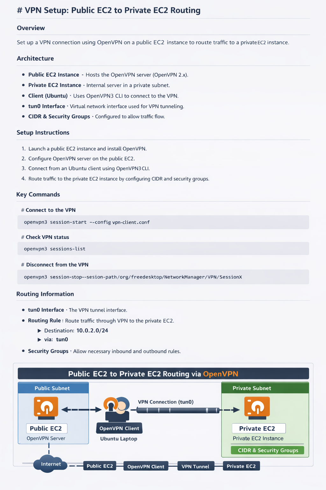

# 🚀 OpenVPN-Based Secure AWS Architecture

## 📌 Project Overview

This project demonstrates a secure DevOps architecture using OpenVPN to enable controlled access to private AWS resources. A public EC2 instance acts as a VPN gateway, allowing secure communication with a private EC2 instance inside a VPC.

---

## 🏗️ Architecture Workflow

1. User connects to OpenVPN server using client configuration (.ovpn file).
2. VPN tunnel (tun0) is established.
3. User gets IP from VPN subnet.
4. Traffic is routed through public EC2 (VPN server).
5. Security Groups allow VPN subnet to access private EC2.
6. Private EC2 responds via VPN tunnel.

---

## 🧠 Core Concepts Explained

### 1. Virtual Private Cloud (VPC)

A logically isolated network in AWS where resources are deployed.

### 2. Public EC2 (VPN Server)

* Hosts OpenVPN server
* Has public IP
* Acts as entry point

### 3. Private EC2

* No public IP
* Accessible only via VPN or internal network

### 4. OpenVPN

An open-source VPN solution that creates encrypted tunnels between client and server.

### 5. TUN Interface (tun0)

A virtual network interface created after VPN connection.

### 6. Routing

Defines how traffic flows between networks.

### 7. Security Groups

Firewall rules controlling inbound/outbound traffic.

---
## 🏗️ Architecture Workflow


## ⚙️ OpenVPN Setup Commands

### Install OpenVPN3

```bash
sudo apt update
sudo apt install openvpn3
```

### Import Config

```bash
openvpn3 config-import --config client.ovpn --persistent
```

### Start Session

```bash
openvpn3 session-start --config client.ovpn
```

### List Sessions

```bash
openvpn3 sessions-list
```

### Disconnect Session

```bash
openvpn3 session-manage --disconnect --path <session-path>
```

### Remove Config

```bash
openvpn3 config-remove --config client.ovpn
```

---

## 🌐 Networking & Routes

### Check VPN Interface

```bash
ip a | grep tun0
```

### View Routes

```bash
ip route
```

### Example VPN Routes

```
0.0.0.0/1 via 172.x.x.x dev tun0
128.0.0.0/1 via 172.x.x.x dev tun0
172.x.x.x/22 dev tun0
```

### Enable IP Forwarding

```bash
sudo sysctl -w net.ipv4.ip_forward=1
```

---

## 🔐 Security Group Configuration

### Public EC2

* Allow: UDP 1194 (OpenVPN)
* Allow: SSH (22)

### Private EC2

* Allow: VPN Subnet CIDR
* Allow: Public EC2 SG

---

## 📊 Workflow Summary

User → VPN Client → Public EC2 (OpenVPN) → Private EC2

---

## 🎯 Key Benefits

* Secure remote access
* No exposure of private EC2
* Encrypted communication
* Scalable architecture

---

## 🧪 Troubleshooting

### Check Connection

```bash
ping <private-ip>
```

### Verify Tunnel

```bash
ip a | grep tun0
```

### Check Logs

```bash
journalctl -u openvpn
```

---

## 🏁 Conclusion

This project ensures secure, scalable, and production-ready connectivity using OpenVPN in AWS.
